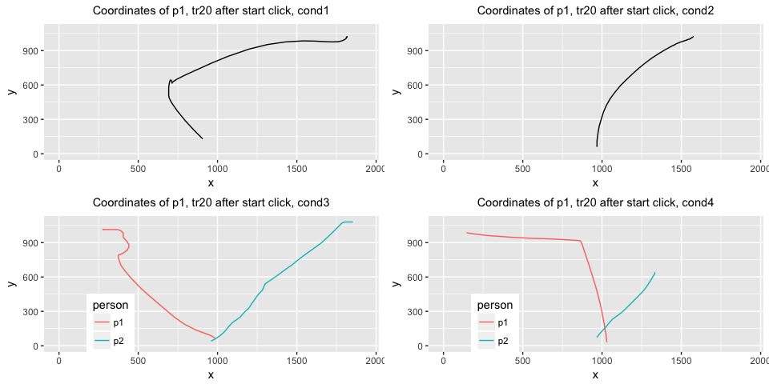
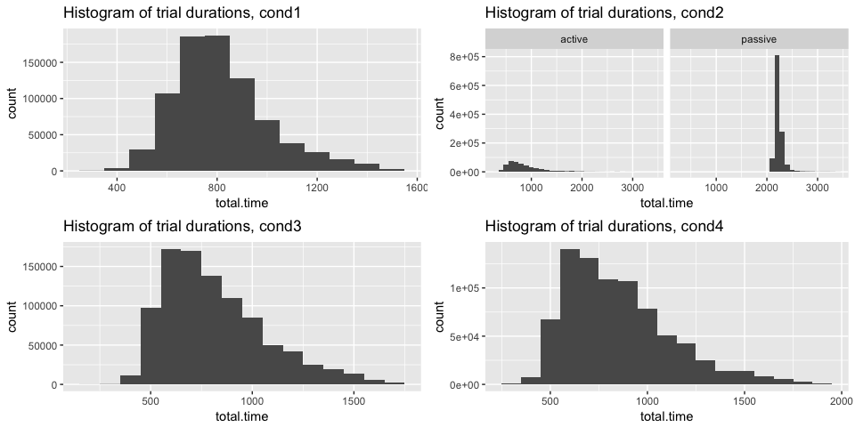
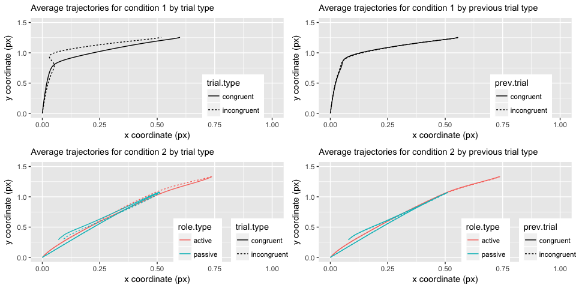
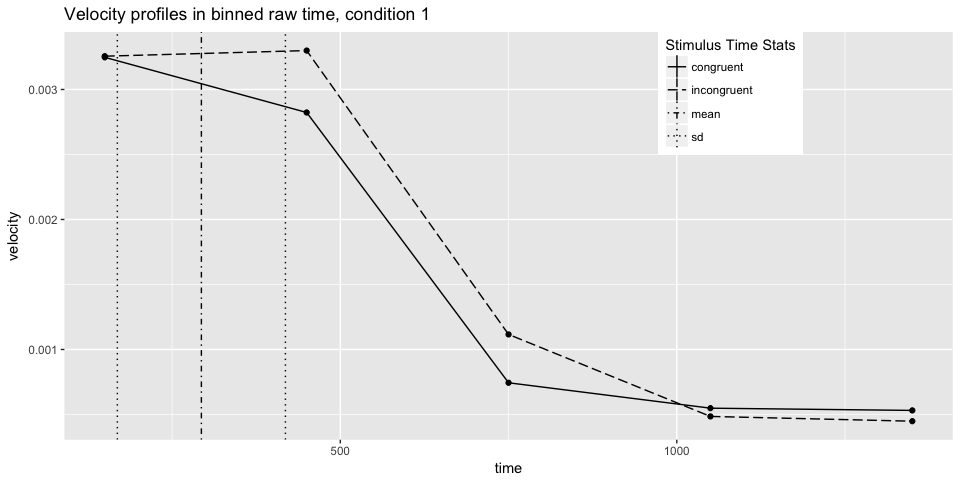

# Mouse-tracking Social Simon


This is a complete script for analyzing mouse trajectories collected in the
mouse-tracking Social Simon task. The complete experiment consisted of 4 conditions:

* condition 1: individual Simon task, in which a person had to respond to two colors by moving
right or left and clicking on a response "button"
* condition 2: individual go-nogo version of the Simon task, in which a person had to respond
to only one of the two colors
* condition 3: social Simon task with visual feedback, in which two people carried out the task
together, responding each to one of the colors; the visual feedback consisted in
perceiving the mouse cursor of the co-participant
* condition 4: social Simon task with no visual feedback, in which two people carried out
the task as in the third condition but could only see their own mouse cursor
on the screen

The script goes from data-preprocessing through various ways to analyze mouse-tracking
data that have been applied in the literature. This version of the script
carries out analysis only on the condition 3 as it is of highest interest in this
study. It can be applied directly to analyzing data from condition 4 and with slight
modifications to conditions 1 and 2.


# Data pre-processing

First of all we save the screen dimensions and relevant coordinates used in the experiment.


```r
# save experiment parameter values
screen.width <- 1920
screen.height <- 1080
start.boundary <- 988 # upper boundary of the start button
response.boundary <- 128 # lower boundary of response boxes
stim.boundary <- 820 # the y-coord that needed to be crossed for stimulus to appear
```


We then begin by loading the data and reformatting it for easier processing.


Then we add the coding for independent variables on 

* trial type, which depends on the congruency between the color of the cue and 
its location
* whose turn it was to respond in a given trial, which depends on the color of the cue
* previous trial type and whose turn it was to respond


The y-coordinates are immediately flipped vertically because the package that was
used for collecting the data (Matlab Psychtoolbox) encodes the screen's top left 
as coordinates [0, 0] and therefore y-coordinates grow towards the bottom of the screen
while for ease of analysis we would like them to grow towards the screen's top.

We plot an example trial before any further pre-processing. The complete trajectory 
that is plotted contains all coordinates recorded since the start of the
trial and so also before the participants clicked on the start button located
at the bottom of the screen.

<!-- -->

Now we filter out only successful trials, in which participants did not miss any
deadlines and a correct response was given.


Complete trajectories will be needed for the dynamical part of our analysis at 
the end of this script. For remaining analyses we need to extract
the portions of the trajectories after participants have clicked on the start
button.


<!-- -->

For convenience we rescale the coordinates into a standard MouseTracker 
coordinate space, where x is in range [-1, 1] and y in range [0, 1.5].


<!-- -->

Now we align all the trajectories to the common [0, 0] origin and timestamps
to start at 0.


<!-- -->

At this point we can already visualize all trajectories of all individual participants
and pairs.

<!-- --><!-- --><!-- --><!-- -->

We see that most pairs seem to divide the screen space between each other
by moving mostly directly towards their assigned response box and avoiding the center.
However, there are exceptions. 

In condition 3 (with visual feedback) one particular pair (number 7) has mostly 
upward moving trajectories. We can further explore here whether the joint upward 
motion is induced by one of the participants or happens immediately on both sides.

<!-- -->

The plot presents trajectories in the first couple of trials (2, 3, 5, 6, 7) of two
participants from pair 7. The trajectories are colored red for when participant's
role was "active", i.e. the cue that appeared had their assigned color and blue for
when their role was "passive", i.e. their task in such a trial was to not press
the response button and simply go back to the start position.

From the plots it would appear that one of the members of this aberrant couple
(person 2) adopts a "move upward" strategy from the start, independently of whether
it is their turn to respond or not. The other person in that couple seems to copy
the co-actor's movements on passive trials and make large discrete errors on the trials
in which it is actually their turn to respond. Why this particular couple behaves
in this manner is unfortunately unknown and might indicate some individual differences,
the feeling of jointness experienced by this couple or conscious strategies that 
people adopt in such a task.

In condition 4 (without visual feedback) it is rather than certain individuals 
adopt the "move upward" strategy, independently of their partner (which is to be
expected since they do not see the partner's movements).

As the next pre-processing step we will flip all trajectories to one side.
This ensures that every trajectory starts at the bottom of the coordinate system 
and ends in the top right corner. It is done to obtain comparable trajectory 
measures.


As a last step, a look at sampling rate distribution to see whether it reveals 
any outliers that could indicate missing data or wrong recording.


From the data we can extract all intervals between adjacent sampling points and
calculate their mean and standard devation. We then establish a cutoff point of
3 SD from the mean beyond which the sampling interval is considered to be an outlier.
We calculate the number of such outliers for each condition and their mean sampling
rate. The resulting numbers are presented in the following table.


              rate.means   rate.sds   rate.cutoff   num.outliers   mean.outliers
-----------  -----------  ---------  ------------  -------------  --------------
condition1         10.87       0.01         10.88            596           10.90
condition2         10.87       0.01         10.91              8           13.60
condition3         10.87       1.30         14.78             41          207.71
condition4         10.87       0.53         12.47             39           42.92

It turns out that the means sampling rate for all conditions is 
within expected parameters given the set sampling rate of 92 Hz. The number of
outliers and their means varies per condition with much larger deviations in social
conditions. Given the cross-computer data stream in these conditions, some amount
of data loss was to be expected. In order to facilitate binned data analysis, 
we remove trials that contain these large deviations (separately for each condition).

Next we look at y coordinates that should not be lower than some margin around 0
(after flipping and alignment). A y-coordinate that is more negative indicates a
faulty recording of the start button press.


With the sampling timing issues fixed, we can examine reaction time outliers and
add another variable to the data, which indicates whether the trial was fast or slow.


<!-- -->

Note that in condition 2 the histogram looks markedly different for active and
passive trials. This is because when participant was supposed to refrain from 
responding, they had to simply wait for the trial to end.

After we produced clean data for all conditions, we combine the two social ones 
into a single data frame.


For the analysis we will use a mousetrap package. Accordingly, the next step is 
to transform the data into a mousetrap object.


As a final pre-processing step, we perform time normalization on the data, in 
which the times and coordinates are linearly interpolated so that each trajectory 
contains the same number of recorded points, typically this is set to 101 points.


We need to check that all participants have a balanced number of observations 
for different variables of interest.


<!-- --><!-- --><!-- --><!-- -->

From the counts plot, we can see that in condition 1 and 2 one person in each
has markedly less successful trials than other participants. In condition 3, 
even though different numbers of trials remain for different pairs after removing 
unsuccessful ones, there are similar counts for different trial and role types.

By contrast, in condition 4, three of the pairs completely lose observations for
one of the incongruent set of trials, namely participants with ids 14, 23, 29 
lose incongruent active trials while their co-actors (ids 13, 24, 30) incongruent
passive ones. Further investigation of these counts reveals that the crucial step
that leads to this loss is filtering out trials in which incorrect response was
given, that is, participant clicked on the wrong response box. Given that this 
correlates with trials being incongruent (the cue appeared on the same side as
the incorrect response box), we might infer that participants 14, 23 and 29
misunderstood the task, i.e. they were responding to the location of the cue, rather
than its color. We can confirm this conclusion by plotting the trajectories of
these participants.

<!-- -->

We see that indeed, 3 participants in condition 4 misunderstood the instructions
and therefore need to be removed from further analysis.


As a result of data cleaning, 13%, 3%, 
4%, 27% of trials in conditions 1 to 4 are removed.

# Dependent variables calculation

There is a number of measures that can be calculated on the basis of raw time
and normalized trajectories. 
First, we retrieve trajectory derivatives (velocity, acceleration) and angles 
from the raw time data. Next, we calculate a variety of measures on normalized
data. 


These are the measures that are returned:

| Measure | Definition |
|:--------|:-----------------------------------------------|
|xpos_max|   Maximum x-position|
|xpos_min|   Minimum x-position|
|ypos_max|   Maximum y-position|
|ypos_min|   Minimum y-position|
|MAD|        Signed Maximum absolute deviation from the direct path connecting start and end point of the trajectory (straight line). If the MAD occurs above the direct path, this is denoted by a positive value; if it occurs below, by a negative value.|
| MAD_time|   Time at which the maximum absolute deviation was reached first|
| MD_above|   Maximum deviation above the direct path|
| MD_above_time|  Time at which the maximum deviation above was reached first|
| MD_below|   Maximum deviation below the direct path|
| MD_below_time|  Time at which the maximum deviation below was reached first|
| AD|         Average deviation from direct path|
| AUC|        Area under curve, the geometric area between the actual trajectory and the direct path where areas below the direct path have been subtracted|
| xpos_flips|         Number of directional changes along x-axis (exceeding the distance specified in flip_threshold)|
| ypos_flips|         Number of directional changes along y-axis (exceeding the distance specified in flip_threshold)|
| xpos_reversals|     Number of crossings of the y-axis|
| ypos_reversals|     Number of crossings of the x-axis|
| RT|                 Response time, time at which tracking stopped|
| initiation_time|    Time at which first mouse movement was initiated|
| idle_time|    Total time without mouse movement across the entirety of the trial|
| hover_time|         Total time of all periods without movement in a trial (whose duration exceeds the value specified in hover_threshold)|
| hovers|             Number of periods without movement in a trial |
| total_dist|     Total euclidean distance covered by the trajectory|
| vel_max|       Maximum velocity|
| vel_max_time|   Time at which maximum velocity occurred first|
| vel_min|   Minimum velocity|
| vel_min_time|   Time at which minimum velocity occurred first|
| acc_max|        Maximum acceleration|
| acc_max_time|   Time at which maximum acceleration occurred first|
| acc_min|        Minimum acceleration|
| acc_min_time|   Time at which minimum acceleration occurred first|

Out of these measures, the most widely used are measures of the curvature of mouse
trajectories, i.e. MAD, AD and AUC. A variety of time-based measures allows us
to examine movement duration in different stages of the trajectory. Finally,
coordinate flips and reversals are a proxy for movement complexity (which we
later examine also with entropy-based measure).

For the purpose of this paper we will focus on the shape of movement trajectories
and velocity profiles in the exploratory part of our analysis. In the inferential
part we will examine only overall reaction time RT, area under curve AUC and sample
entropy ENT. 

Our data for conditions 2 to 4 contains trials in which a participant's role was 
'active', i.e., it was their turn to respond to the cue and trials in which the role was 'passive', i.e., their task was to refrain from responding. 
It is reasonable to assume that different cognitive processes are at play in 
these types of trials and that different trajectories should result. 
Therefore, for further analysis we split the data into two groups: 
active and passive data.


# Exploratory Analysis

First we will visually examine trajectories averaged across trials
for each participant and across participants. They are averaged separately
for each independent variable of interest, which would allow us to reveal
different patterns depending on the variables we decide to include (if there are
such patterns in the data obviously).

Our independent variables of interest are:

* trial type: congruent or incongruent
* previous trial type: whether trial at time t-1 was congruent or not
* previous role type: whether in the previous trial participant had to act

<!-- -->

Now for the social conditions.

<!-- -->

From these plots it would seem that neither of the independent variables
affects the shape of movement trajectory and furthermore that participants go
straight for their assigned response button instead of producing curved trajectories
typically found in mouse-tracking studies. 

However, to check whether this overall pattern holds on the individual level, 
we can also plot average trajectories for individual participants, focusing here 
on the effect of current trial type, for active and passive data.


<!-- --><!-- --><!-- --><!-- -->

Here we can make several observations. First, even though the general pattern that
we see on the group level holds for majority but not all individuals. There are
3 participants in condition 3 and 2 participants in condition 4 do exhibit trajectories
that go upwards first and then to the response box (curved trajectories). For 
some of these individuals we can also note a slightly bigger curve in incogruent
active trials but no difference in passive trials. Furthermore, all of them show
shorter trajectories in passive than active trials, while most participants with 
straight trajectories seem to proceed all the way to the response box even when
it is not their turn to respond, i.e. despite the fact that they could return to 
the starting position as soon as it became clear it is not their trial.

We can confirm the latter observation by also plotting a histogram of maximum y 
coordinate reached in passive trials. The thresholds indicated on the plot are the 
locations of the start boundary, the y-coordinate that had to be crossed in order 
for the cue to appear and the lower response box boundary. As can be seen from the plot,
the majority of trajectories goes beyond that last threshold.

<!-- -->

For the following plots we will separate straight-trajectory participants from the
curved-trajectory participants in conditions 2, 3 and 4 as they seem to behave in a qualitatively different manner.


In addition to plotting time-normalized trajectories in full, we can bin them into
several intervals with the aim of further subjecting the bins to inferential testing.

<!-- --><!-- --><!-- --><!-- --><!-- -->

Some analyses, such as looking at movement velocity profiles, require retaining 
trajectories in raw time. In this case, we decide how many raw time bins to create 
between 0 ms and some cutoff (e.g., 1500 ms) and then create a number of raw time steps. 
Thus, each step (i.e., coordinate pair) of a trajectory reflects the location of 
the mouse during some raw time bin (e.g., 500-600 ms if bins are 100 ms wide).


Once we have created such raw time bins, we can look at velocity in different
types of trials. The literature suggests, for example, that stronger competition 
between response options should be characterized by an initial decreased velocity 
as competing choices inhibit each other, followed by an increase in velocity once 
the system converges upon a decision and the inhibition is alleviated. 
Thus, analyzing velocity data can allow for inferences about when commitments to 
a particular response are made.

In our particular case, we might also ask whether velocity is different between
active and passive trials and whether participants that exhibit qualitatively
different movement trajectories also differ in their velocity profiles.


Here we plot velocity profiles in binned raw time, together with approximate
time in which cue appeared (mean appearance time being 294 ms).

<!-- --><!-- --><!-- --><!-- --><!-- --><!-- --><!-- --><!-- --><!-- -->


# Statistical analysis

Exploratory analysis suggests that conditions differ in how the type of trial
affects movement trajectories. There seem to be notable differences in the individual
Simon condition, with incongruent trials producing more curved movement path. There
seem to be no consistent differences in condition 2. The social conditions 3 and 4
look most like condition 2 with some exceptions.

In this part we will carry out statistical analyses to further probe these observations.
For simplicity we will focus on the difference between trajectories depending on 
current trial type only (congruent vs incongruent) and ignore the effect of previous 
trial for the time being.


## Testing trajectories directly

One way to test whether trajectories differ in different conditions is by
examining directly coordinates of interest. Since the x-coordinate plane is
typically thought to be more relevant to the Simon task, we focus on analyzing
x coordinates.


### Paired t-tests on coordinates

One  approach is to use 101 paired-samples t tests to compare the  x-coordinate 
of participants' mean trajectories for two conditions at each individual time step. 


The test revealed a sequence of 84, 12, 0 and 4 
significant t-tests in conditions 1 to 4 respectively, on the difference between 
x-coordinates in congruent and incongruent trials. In order to determine what is 
the minimum number of significant t-tests that qualifies as a pattern, a bootstrapping 
procedure would be required. However, we can state already that the difference between conditions seems notable and low in conditions 2-4 by comparison with previous
research (where 8 was the minimum) and with condition 1.


## Anovas on binned trajectories: TODO

Other than looking at particular coordinates, we can also run tests on binned
trajectories (both normalized and raw time), that we have also plotted above.
In this case the analysis we perform is repeated measures 3 (bins) by 2 (trial
type) ANOVA. 


```r
avg.tn.trajectory.bins <-  
    mt_aggregate_per_subject(active.straight, 
                            use="av_tn_trajectories",
                            use2_variables=c("condition", "trial.type"),
                            subject_id="personid")
avg.tn.trajectory.bins$bin <- factor(avg.tn.trajectory.bins$steps)

aov_ez(data=avg.tn.trajectory.bins,
       id="personid", dv="xpos", within = c("trial.type", "bin"),
       between="condition",
       anova_table = list(es=c("ges", "pes"), correction=c("GG")))
```

The result tells us that there is an obvious significant difference in x positions
in different time bins (expected given the nature of the task). However, there
is not significant difference by trial type.


```r
avg.slow.trajectory.bins <- mt_aggregate_per_subject(slow.activedata,
                                                     use="av_trajectories",
                                                     use2_variables="trial.type",
                                                     subject_id="personid")
avg.slow.trajectory.bins$bin <- factor(avg.slow.trajectory.bins$timestamps)

avg.fast.trajectory.bins <- mt_aggregate_per_subject(fast.activedata,
                                                     use="av_trajectories",
                                                     use2_variables="trial.type",
                                                     subject_id="personid")
avg.fast.trajectory.bins$bin <- factor(avg.fast.trajectory.bins$timestamps)

# check that each subject has observations in each category
# table(table(avg.slow.trajectory.bins$personid))
# table(table(avg.fast.trajectory.bins$personid))

aov_ez(data=avg.slow.trajectory.bins, id="personid", dv="xpos", 
       within = c("trial.type","bin"),
       anova_table = list(es=c("ges","pes"), correction=c("GG")))

aov_ez(data=avg.fast.trajectory.bins, id="personid", dv="xpos", 
       within = c("trial.type","bin"),
       anova_table = list(es=c("ges","pes"), correction=c("GG")))
# TODO: also velocity
# also on eulidean distance
```

Similarly in raw binned data we find no evidence for significant effect of trial
type.


## Anovas on dependent measures

Having dealt with coordinates, we can move on to looking at dependent measures
typically examined in movement trajectories. That is, the question here is whether
any of the particular measures that summarize trajectories (e.g. maximum x or y
positions, area under curve, x flips) differs between congruent and incogruent
trials, separately for active and passive data. As stated before, we will only
examine RT and AUC here and ENT in the next subsection.


In what follows we will consider our study to employ a mixed design with 1
between-subject (condition) and 1 within-subject variables (trial type).


### Reaction time


```r
by(all.measures.active$RT, list(all.measures.active$trial.type,
                                 all.measures.active$condition), stat.desc, basic=FALSE)
```

```
## : congruent
## : 1
##       median         mean      SE.mean CI.mean.0.95          var 
##  749.2205597  747.1539672   18.1129065   38.0538045 6233.4702747 
##      std.dev     coef.var 
##   78.9523291    0.1056708 
## -------------------------------------------------------- 
## : incongruent
## : 1
##       median         mean      SE.mean CI.mean.0.95          var 
## 8.121267e+02 8.109753e+02 1.629599e+01 3.423661e+01 5.045627e+03 
##      std.dev     coef.var 
## 7.103258e+01 8.758908e-02 
## -------------------------------------------------------- 
## : congruent
## : 2
##       median         mean      SE.mean CI.mean.0.95          var 
## 6.915412e+02 7.363984e+02 4.931343e+01 1.036037e+02 4.620448e+04 
##      std.dev     coef.var 
## 2.149523e+02 2.918967e-01 
## -------------------------------------------------------- 
## : incongruent
## : 2
##       median         mean      SE.mean CI.mean.0.95          var 
## 6.867904e+02 7.443394e+02 5.303003e+01 1.114120e+02 5.343149e+04 
##      std.dev     coef.var 
## 2.311525e+02 3.105472e-01 
## -------------------------------------------------------- 
## : congruent
## : 3
##       median         mean      SE.mean CI.mean.0.95          var 
## 7.080067e+02 7.468482e+02 2.707784e+01 5.631145e+01 1.613061e+04 
##      std.dev     coef.var 
## 1.270063e+02 1.700564e-01 
## -------------------------------------------------------- 
## : incongruent
## : 3
##       median         mean      SE.mean CI.mean.0.95          var 
## 7.135585e+02 7.568695e+02 2.990607e+01 6.219309e+01 1.967621e+04 
##      std.dev     coef.var 
## 1.402719e+02 1.853317e-01 
## -------------------------------------------------------- 
## : congruent
## : 4
##       median         mean      SE.mean CI.mean.0.95          var 
## 7.074354e+02 7.563644e+02 3.380711e+01 7.166787e+01 1.942965e+04 
##      std.dev     coef.var 
## 1.393903e+02 1.842899e-01 
## -------------------------------------------------------- 
## : incongruent
## : 4
##       median         mean      SE.mean CI.mean.0.95          var 
## 7.259981e+02 7.564996e+02 3.126759e+01 6.628432e+01 1.662025e+04 
##      std.dev     coef.var 
## 1.289196e+02 1.704159e-01
```

<!-- --><!-- -->


```
## [1] <NA>
## attr(,"contrasts")
##   cond2vscond1 cond2vscond3 cond2vscond4
## 1            1            0            0
## 2            0            0            0
## 3            0            1            0
## 4            0            0            1
## Levels: 1 2 3 4
```

```
##               Model df      AIC      BIC    logLik   Test  L.Ratio p-value
## baseline          1  4 1785.322 1797.470 -888.6613                        
## trial.type.rt     2  5 1764.848 1780.033 -877.4239 1 vs 2 22.47472  <.0001
## condition.rt      3  8 1770.147 1794.443 -877.0736 2 vs 3  0.70065  0.8731
## rt.mix.model      4 11 1722.911 1756.318 -850.4557 3 vs 4 53.23574  <.0001
```

```
##                                                  Value Std.Error DF
## (Intercept)                                 736.398404 34.622346 73
## trial.typeincongruent                         7.940998  5.900600 73
## conditioncond2vscond1                        10.755563 48.963391 73
## conditioncond2vscond3                        10.449809 47.264718 73
## conditioncond2vscond4                        19.965969 50.382913 73
## trial.typeincongruent:conditioncond2vscond1  55.880342  8.344708 73
## trial.typeincongruent:conditioncond2vscond3   2.080295  8.055208 73
## trial.typeincongruent:conditioncond2vscond4  -7.805809  8.586634 73
##                                                t-value      p-value
## (Intercept)                                 21.2694545 5.176712e-33
## trial.typeincongruent                        1.3457951 1.825335e-01
## conditioncond2vscond1                        0.2196654 8.267448e-01
## conditioncond2vscond3                        0.2210911 8.256387e-01
## conditioncond2vscond4                        0.3962845 6.930511e-01
## trial.typeincongruent:conditioncond2vscond1  6.6965003 3.787050e-09
## trial.typeincongruent:conditioncond2vscond3  0.2582547 7.969371e-01
## trial.typeincongruent:conditioncond2vscond4 -0.9090651 3.663074e-01
```


### Area under curve


```r
by(all.measures.active$AUC, list(all.measures.active$trial.type,
                                 all.measures.active$condition), stat.desc, basic=FALSE)
```

```
## : congruent
## : 1
##       median         mean      SE.mean CI.mean.0.95          var 
##  0.353700830  0.347098780  0.016180164  0.033993262  0.004974156 
##      std.dev     coef.var 
##  0.070527698  0.203192009 
## -------------------------------------------------------- 
## : incongruent
## : 1
##       median         mean      SE.mean CI.mean.0.95          var 
##  0.438618889  0.423144547  0.010478345  0.022014187  0.002086119 
##      std.dev     coef.var 
##  0.045674048  0.107939588 
## -------------------------------------------------------- 
## : congruent
## : 2
##       median         mean      SE.mean CI.mean.0.95          var 
##  0.025300785  0.068998206  0.022792604  0.047885484  0.009870553 
##      std.dev     coef.var 
##  0.099350657  1.439902024 
## -------------------------------------------------------- 
## : incongruent
## : 2
##       median         mean      SE.mean CI.mean.0.95          var 
##   0.02736986   0.07979365   0.02674971   0.05619906   0.01359540 
##      std.dev     coef.var 
##   0.11659930   1.46126028 
## -------------------------------------------------------- 
## : congruent
## : 3
##       median         mean      SE.mean CI.mean.0.95          var 
##  0.002014931  0.036793009  0.026512992  0.055136785  0.015464652 
##      std.dev     coef.var 
##  0.124356954  3.379907195 
## -------------------------------------------------------- 
## : incongruent
## : 3
##       median         mean      SE.mean CI.mean.0.95          var 
##  0.002656911  0.041002347  0.028998952  0.060306622  0.018500662 
##      std.dev     coef.var 
##  0.136017140  3.317301361 
## -------------------------------------------------------- 
## : congruent
## : 4
##       median         mean      SE.mean CI.mean.0.95          var 
##  -0.02155870   0.02673083   0.03474220   0.07365018   0.02051935 
##      std.dev     coef.var 
##   0.14324577   5.35882277 
## -------------------------------------------------------- 
## : incongruent
## : 4
##       median         mean      SE.mean CI.mean.0.95          var 
##  -0.02223459   0.03120178   0.03550553   0.07526837   0.02143093 
##      std.dev     coef.var 
##   0.14639306   4.69181694
```

<!-- --><!-- -->


```
##                Model df       AIC       BIC   logLik   Test  L.Ratio
## baseline           1  4 -273.4277 -261.2798 140.7138                
## trial.type.auc     2  5 -289.7842 -274.5994 149.8921 1 vs 2 18.35653
## condition.auc      3  8 -361.6327 -337.3371 188.8163 2 vs 3 77.84852
## auc.mix.model      4 11 -399.9932 -366.5867 210.9966 3 vs 4 44.36049
##                p-value
## baseline              
## trial.type.auc  <.0001
## condition.auc   <.0001
## auc.mix.model   <.0001
```

```
##                                                    Value  Std.Error DF
## (Intercept)                                  0.068998206 0.02640397 73
## trial.typeincongruent                        0.010795447 0.00804089 73
## conditioncond2vscond1                        0.278100574 0.03734085 73
## conditioncond2vscond3                       -0.032205198 0.03604539 73
## conditioncond2vscond4                       -0.042267379 0.03842341 73
## trial.typeincongruent:conditioncond2vscond1  0.065250320 0.01137154 73
## trial.typeincongruent:conditioncond2vscond3 -0.006586108 0.01097703 73
## trial.typeincongruent:conditioncond2vscond4 -0.006324490 0.01170121 73
##                                                t-value      p-value
## (Intercept)                                  2.6131758 1.088687e-02
## trial.typeincongruent                        1.3425686 1.835718e-01
## conditioncond2vscond1                        7.4476235 1.528370e-10
## conditioncond2vscond3                       -0.8934623 3.745458e-01
## conditioncond2vscond4                       -1.1000422 2.749281e-01
## trial.typeincongruent:conditioncond2vscond1  5.7380392 2.038578e-07
## trial.typeincongruent:conditioncond2vscond3 -0.5999902 5.503708e-01
## trial.typeincongruent:conditioncond2vscond4 -0.5404986 5.904985e-01
```


# Distributional analyses

Sometimes, averaging trajectories produces artifical results. For example, a smooth
average trajectory for a given participant could be a result of a large number
of straight trajectories that go directly to the target and discrete error type
of trajectories where participant first moves directly to the wrong side and then
abruptly changes direction (as one of the members of couple 7).

The main method to eliminate this possibility relies on bimodality analysis.
Another method includes mapping data to "trajectory prototypes".

## Bimodality analysis

This analysis checks if any of the spatial measures are bimodally distributed.


```r
# standardize measures per participant
activedata <- mt_standardize(activedata, use_variables = c("MAD", "AUC", "AD"), 
                             within = "personid", prefix = "z_")

# merge trial level data (needed for distribution qplot with facets)
mt.merged <- merge(activedata$data, activedata$measures, by="mt_id")

# plot distributions
qplot(x=z_MAD, data=mt.merged, bins=50) + facet_grid(trial.type ~ .)
```

<!-- -->

```r
qplot(x=z_AUC, data=mt.merged, bins=50) + facet_grid(trial.type ~ .)
```

<!-- -->

```r
qplot(x=z_AD, data=mt.merged, bins=50) + facet_grid(trial.type ~ .)
```

<!-- -->

```r
# calculate bimodality coefficient
bm.check <- mt_check_bimodality(activedata, 
                                use_variables = c("z_MAD", "z_AUC", "z_AD"), 
                                grouping_variables = "trial.type", methods = "BC")
bm.check
```

```
## $BC
##    trial.type     z_MAD     z_AUC      z_AD
## 1   congruent 0.2600469 0.2264174 0.1967166
## 2 incongruent 0.2598736 0.2337273 0.2051982
```

A distribution is considered bimodal if BC > 0.555. In our case both distribution
plots and bimodality coefficient give no reason to suspect bimodal data that could
blur our results.


## Trajectory prototypes

Mousetrap package provides a possibility for mapping collected trajectories
to a number of trajectory prototypes frequently encountered in mouse tracking
experiments.


```r
activedata <- mt_spatialize(activedata, n_points=50)

proto <- mt_remap_symmetric(mt_prototypes, remap_xpos = "right")
mt_plot(proto, facet_col="mt_id") +
    facet_grid(.~factor(mt_id,levels=unique(mt_id))) +
    ggtitle("Trajectory prototypes")
```

<!-- -->

```r
activedata <- mt_map(activedata, use="sp_trajectories", prototypes = proto)
mt_plot(activedata, use="sp_trajectories", 
        use2="prototyping",
        facet_col="prototype_label")
```

<!-- -->

Even in the presence of some variability of trajectories, it seems that their
vast majority is straight.

# Trajectory dissection with PCA

Mouse trajectories are typically thought to result from a number of cognitive 
processes that depend on different factors within a trial. In order to examine
the contribution of these processes to the overall trajectory, two main methods
have been proposed: Principal Components Analysis (PCA) and visualization of beta
weights.

## PCA

To conduct PCA we use time-normalized trajectories averaged within each participant.
We will focus on components underlying x coordinates.


```r
traj.avg <- mt_aggregate_per_subject(mtdata, 
                                        use="tn_trajectories",
                                        use2_variables=c("role.type","trial.type"),
                                        subject_id="personid")
ta <- dplyr::select(traj.avg, personid, role.type, trial.type, mt_seq, xpos)
ta$grp <- paste(ta$personid, ta$role.type, ta$trial.type)

ggplot(ta, aes(x=mt_seq, y=xpos, color=role.type, linetype=trial.type, group=grp)) + 
    geom_path() + ggtitle("Average trajectories of all participants")
```

<!-- -->

```r
mt_plot_aggregate(mtdata, use = "tn_trajectories", 
                  x = "steps", y = "xpos", 
                  color = "trial.type", linetype="role.type",
                  subject_id = "personid") +
    theme(legend.position=c(.75,.25), legend.box='horizontal') + 
    ggtitle("Average trajectories combined by role and trial type")
```

<!-- -->

```r
# transpose into wide format
traj.wide <- dcast(ta, formula=personid + role.type + trial.type ~ mt_seq, 
                   value.var="xpos")
tw <- traj.wide[,-4]

# separate by trial and role types into different data frames
tw %>% filter(., role.type=="active", trial.type=="congruent") %>%
    dplyr::select(-c(personid, role.type, trial.type)) -> tw.act.congr
tw %>% filter(., role.type=="passive", trial.type=="congruent") %>%
    dplyr::select(-c(personid, role.type, trial.type)) -> tw.pass.congr
tw %>% filter(., role.type=="active", trial.type=="incongruent") %>%
    dplyr::select(-c(personid, role.type, trial.type)) -> tw.act.incongr
tw %>% filter(., role.type=="passive", trial.type=="incongruent") %>%
    dplyr::select(-c(personid, role.type, trial.type)) -> tw.pass.incongr

# run PCA on coordinates   
pca.act.congr <- prcomp(tw.act.congr, center = TRUE, scale = TRUE)
pca.pass.congr <- prcomp(tw.pass.congr, center = TRUE, scale = TRUE)
pca.act.incongr <- prcomp(tw.act.incongr, center = TRUE, scale = TRUE)
pca.pass.incongr <- prcomp(tw.pass.incongr, center = TRUE, scale = TRUE)

var.explained <- function(sdev) {
    pr_var <- sdev^2
    prop_varex <- pr_var[1:3]/sum(pr_var) * 100
    return(prop_varex)
}

explained <- matrix(nrow=4, ncol=3)
explained[1,] <- var.explained(pca.act.congr$sdev)
explained[2,] <- var.explained(pca.pass.congr$sdev)
explained[3,] <- var.explained(pca.act.incongr$sdev)
explained[4,] <- var.explained(pca.pass.incongr$sdev)
explained <- as.data.frame(explained)
explained$grp <- c('act.congr', 'pass.congr', 'act.incongr', 'pass.incongr')

# select top 3 components from each type of trial
components <- data.frame("comp1.act.congr" = pca.act.congr$rotation[,1],
                         "comp2.act.congr" = pca.act.congr$rotation[,2],
                         "comp3.act.congr" = pca.act.congr$rotation[,3],
                         "comp1.pass.congr" = pca.pass.congr$rotation[,1],
                         "comp2.pass.congr" = pca.pass.congr$rotation[,2],
                         "comp3.pass.congr" = pca.pass.congr$rotation[,3],
                         "comp1.act.incongr" = pca.act.incongr$rotation[,1],
                         "comp2.act.incongr" = pca.act.incongr$rotation[,2],
                         "comp3.act.incongr" = pca.act.incongr$rotation[,3],
                         "comp1.pass.incongr" = pca.pass.incongr$rotation[,1],
                         "comp2.pass.incongr" = pca.pass.incongr$rotation[,2],
                         "comp3.pass.incongr" = pca.pass.incongr$rotation[,3])

components.long <- melt(components)
components.long$steps <- rep(c(1:100), 12)
components.long <- separate(components.long, variable, 
                            into = c("component", "role", "condition"))
ggplot(components.long, aes(x=steps, y=value, color=component)) + 
    geom_path() + facet_grid(role~condition) + 
    ggtitle("Top 3 principal components by trial and role type")
```

<!-- -->

Given the resulting plots, we could surmise that the first component, which explains
about 69% of variance in active trials and 
75% in passive trials, reflects the constant tendency to move in a certain direction. The second component, which explains about 
20% in all types of trials decreases in congruent 
active trials while it increases in all other types. Finally, the third
component that explains 9% in active and 
2% in passive trials has also different shape between these
two types of trials.

## Beta weights

Following Scherbaum et al., we also examine trajectory angles. (TODO)
They have applied the following steps to visualize different trajectory components:

1. Angles were standardized for each participant to be between -1 and 1.
2. Created two bins of trials by a split at the median RT for each subject 
(bin 1, fast trials: M(RT) = 501 ms; bin 2, slow trials:M(RT) = 652 ms).
3. Coded four predictors for all trials: directionN(left/right), 
locationN (left/right), responseN-1(left/right), congruencyN-1. Predictors were 
coded with values -1 and 1 for easier interpretation.
4. Performed 100 multiple regressions for 4 predictors on 100 time steps separately
for each participant, which yielded 4 time-varying beta weights for each participant.
5. Computed grand average of these beta weights across participants.
6. Strength of each peak tested with one-sample t-tests of the peak beta weight
against 0.


```r
# plot trials split by 4 predictors
# plot beta weights against time
```


# Dynamical analyses

Finally, given that we are working with continuous data, we can try to apply
analyses that come from dynamical systems approach to cognition to see if
such measures can detect regularities that are missed by traditional statistical
methods.

## Sample entropy

In some cases, it may be helpful to measure the complexity of mouse trajectories. 
For example, if both response alternatives simultaneously attract participants'
mouse movement (relative to only one), this additional stress might manifest 
as less smooth, more complex, and fluctuating trajectories. 
Some mouse-tracking studies have used "x-flips", others opted for sample entropy,
a measure of predictability of trajectory given a number of surrounding coordinates.
We have seen above that a measure of x-flips did not deliver statistically significant
results. Here we calculate sample entropy, using default settings.


```r
# first for active data
# calculate sample entropy for lag 3
activedata <- mt_sample_entropy(activedata, use="tn_trajectories", m=3, 
                                dimension="xpos")
# aggregate per participant
agg.entropy.active <- mt_aggregate_per_subject(activedata, subject_id = "personid",
                                        use_variables = "sample_entropy", 
                                        use2_variables = "trial.type")
# test the difference
mt_aggregate(activedata, subject_id = "personid",
             use_variables = "sample_entropy", use2_variables = "trial.type")
```

```
##    trial.type sample_entropy
## 1   congruent     0.09608580
## 2 incongruent     0.09717253
```

```r
t.test(sample_entropy~trial.type, data=agg.entropy.active, paired=TRUE)
```

```
## 
## 	Paired t-test
## 
## data:  sample_entropy by trial.type
## t = -1.1591, df = 38, p-value = 0.2536
## alternative hypothesis: true difference in means is not equal to 0
## 95 percent confidence interval:
##  -0.0029847149  0.0008112553
## sample estimates:
## mean of the differences 
##             -0.00108673
```

```r
# for passive data
# calculate sample entropy for lag 3
passivedata <- mt_sample_entropy(passivedata, use="tn_trajectories", m=3, 
                                dimension="xpos")
# aggregate per participant
agg.entropy.passive <- mt_aggregate_per_subject(passivedata, subject_id = "personid",
                                        use_variables = "sample_entropy", 
                                        use2_variables = "trial.type")
# test the difference
mt_aggregate(passivedata, subject_id = "personid",
             use_variables = "sample_entropy", use2_variables = "trial.type")
```

```
##    trial.type sample_entropy
## 1   congruent     0.08248634
## 2 incongruent     0.08433156
```

```r
t.test(sample_entropy~trial.type, data=agg.entropy.passive, paired=TRUE)
```

```
## 
## 	Paired t-test
## 
## data:  sample_entropy by trial.type
## t = -1.7216, df = 35, p-value = 0.09398
## alternative hypothesis: true difference in means is not equal to 0
## 95 percent confidence interval:
##  -0.004021170  0.000330721
## sample estimates:
## mean of the differences 
##            -0.001845224
```

```r
# TODO: entropy along y axis, angles?
```
It would seem that there is no difference in complexity of x coordinates
between different trial types in either active or passive data.


## Coupling

Another question one might ask in a joint action scenario is whether participants'
responses are more correlated within an experimental pair than across different
pairs and whether this depends on the availability of visual information about
the co-actor's movements. 

The measure that is most frequently used in the DST community is cross-recurrence
quantification analysis (CRQA) that is an index of the coupling between two time
series. Crudely put, it relies on reconstructing phase spaces of the systems from 
a given data and checking whether the states that the systems visit are close to 
each other.

In order to carry out such analysis, 3 hyperparameters need to be set or determined:

* radius: cutoff boundary that will determine if two points are recurrent or not
* delay: how many points to consider when looking for recurrence
* embedding dimension: lag unit

This can be done either based on the literature or sampled from and optimized for
a number of trials in the data and then applied to the remaining trials. Given
that we are aware of no studies that have applied CRQA to mouse-tracking data,
we opt for the latter option. We estimate the parameters based on a random sample
of trials and compute CRQA measures for all trials for all pairs.


Having computed the CRQA metrics, one can visualize the different trials, as
well as perform statistical analyses on the measures obtained.

RQA plots visualize how the states of the system evolve over time, while the
measures we can look at are as follows:

| Measure | Definition |
|:-----------------------|:-----------------------------------------------|
|recurrence rate|               how often the system visits the same state|
|determinism|                   how often the same sequences repeat|
|meanline and maxline|          how long are repeating sequences|
|entropy|                       how many repeating patterns are there|
|laminarity and trapping time|  how long the time series remains in the same state|
|trend|                         whether it's stationary|

The most widely used of these are recurrence rate (RR) and determinism.

Just to get a feel for these measures we can first examine the example trials in 
which coupling (as indexed by RR and determinism) has been estimated to be low 
and high.


Subsequently we can see if coupling is higher within couples than across and whether
it is affected by the presence of visual information (TODO: compare to coupling
in condition 4).

Judging whether coupling within couples is indeed present typically implies a 
comparison between coupling calculated for real couples and coupling calculated
for so-called surrogate (virtual, fake) couples. That is, we take data from the
same people but form new pairs from them and compute the same CRQA measures. Of
course, given that people perform the same task, some amount of coupling is expected
to hold just by virtue of the task requirements. However, if there is significant
coupling between people who perform the task together, it should be higher between
people who actually performed it together than between people who merely performed
the same task.


From the plot as well as t-test it seems that real couples do not show higher
level of coupling than fake pairs. This, together with a lack of social Simon
effect in the standard trajectory measures, as well as trajectories showing spatial
division of labor, suggests that people performed the task individually, rather 
than approaching it as a social, joint activity.

## Fractal analysis

Fractal measures detrmine how variability scales with sample size. Low level
of self-similarity typically indicates a random process, medium level - 
self-organization, while high level an influence of external constraints on
the unfolding of cognitive dynamics.
(TODO)

