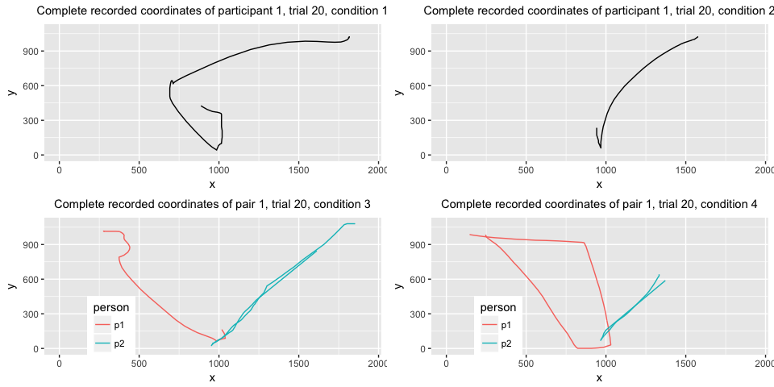

# Mouse-tracking Social Simon


This is a complete script for analyzing mouse trajectories collected in the
mouse-tracking Social Simon task. The complete experiment consisted of 4 conditions:

* condition 1: individual Simon task, in which a person had to respond to two colors by moving
right or left and clicking on a response "button"
* condition 2: individual go-nogo version of the Simon task, in which a person had to respond
to only one of the two colors
* condition 3: social Simon task with visual feedback, in which two people carried out the task
together, responding each to one of the colors; the visual feedback consisted in
perceiving the mouse cursor of the co-participant
* condition 4: social Simon task with no visual feedback, in which two people carried out
the task as in the third condition but could only see their own mouse cursor
on the screen

The script goes from data-preprocessing through various ways to analyze mouse-tracking
data that have been applied in the literature. This version of the script
carries out analysis only on the condition 3 as it is of highest interest in this
study. It can be applied directly to analyzing data from condition 4 and with slight
modifications to conditions 1 and 2.


# Data pre-processing

First of all we save the screen dimensions and relevant coordinates used in the experiment.


```r
# save experiment parameter values
screen.width <- 1920
screen.height <- 1080
start.boundary <- 988 # upper boundary of the start button
response.boundary <- 128 # lower boundary of response boxes
stim.boundary <- 820 # the y-coord that needed to be crossed for stimulus to appear
```


## Load data

We then begin by loading the data and reformatting it for easier processing.


Then we add the coding for independent variables on 

* trial type, which depends on the congruency between the color of the cue and 
its location
* whose turn it was to respond in a given trial, which depends on the color of the cue
* previous trial type and whose turn it was to respond


The y-coordinates are immediately flipped vertically because the package that was
used for collecting the data (Matlab Psychtoolbox) encodes the screen's top left 
as coordinates [0, 0] and therefore y-coordinates grow towards the bottom of the screen
while for ease of analysis we would like them to grow towards the screen's top.

We plot an example trial before any further pre-processing. The complete trajectory 
that is plotted contains all coordinates recorded since the start of the
trial and so also before the participants clicked on the start button located
at the bottom of the screen.

<!-- -->

Now we filter out only successful trials, in which participants did not miss any
deadlines and a correct response was given.


## Extract relevant trajectory

Complete trajectories will be needed for the dynamical part of our analysis at 
the end of this script. For remaining analyses we need to extract
the portions of the trajectories after participants have clicked on the start
button.


<!-- -->

## Rescale space

For convenience we rescale the coordinates into a standard MouseTracker 
coordinate space, where x is in range [-1, 1] and y in range [0, 1.5].


<!-- -->

## Align to common origin

Now we align all the trajectories to the common [0, 0] origin and timestamps
to start at 0.


<!-- -->

At this point we can already visualize all trajectories of all individual participants
and pairs.

<!-- --><!-- --><!-- --><!-- -->

We see that most pairs seem to divide the screen space between each other
by moving mostly directly towards their assigned response box and avoiding the center.
However, there are exceptions. 

In condition 3 (with visual feedback) one particular pair (number 7) has mostly 
upward moving trajectories. We can further explore here whether the joint upward 
motion is induced by one of the participants or happens immediately on both sides.

<!-- -->

The plot presents trajectories in the first couple of trials (2, 3, 5, 6, 7) of two
participants from pair 7. The trajectories are colored red for when participant's
role was "active", i.e. the cue that appeared had their assigned color and blue for
when their role was "passive", i.e. their task in such a trial was to not press
the response button and simply go back to the start position.

From the plots it would appear that one of the members of this aberrant couple
(person 2) adopts a "move upward" strategy from the start, independently of whether
it is their turn to respond or not. The other person in that couple seems to copy
the co-actor's movements on passive trials and make large discrete errors on the trials
in which it is actually their turn to respond. Why this particular couple behaves
in this manner is unfortunately unknown and might indicate some individual differences,
the feeling of jointness experienced by this couple or conscious strategies that 
people adopt in such a task.

In condition 4 (without visual feedback) it is rather than certain individuals 
adopt the "move upward" strategy, independently of their partner (which is to be
expected since they do not see the partner's movements).

## Flip trajectories

As the next pre-processing step we will flip all trajectories to one side.
This ensures that every trajectory starts at the bottom of the coordinate system 
and ends in the top right corner. It is done to obtain comparable trajectory 
measures.


## Remove outliers

As a last step, a look at sampling rate distribution to see whether it reveals 
any outliers that could indicate missing data or wrong recording.


From the data we can extract all intervals between adjacent sampling points and
calculate their mean and standard devation. We then establish a cutoff point of
3 SD from the mean beyond which the sampling interval is considered to be an outlier.
We calculate the number of such outliers for each condition and their mean sampling
rate. The resulting numbers are presented in the following table.


              rate.means   rate.sds   rate.cutoff   num.outliers   mean.outliers
-----------  -----------  ---------  ------------  -------------  --------------
condition1         10.87       0.01         10.88            596           10.90
condition2         10.87       0.01         10.91              8           13.60
condition3         10.87       1.30         14.78             41          207.71
condition4         10.87       0.53         12.47             39           42.92

It turns out that the means sampling rate for all conditions is 
within expected parameters given the set sampling rate of 92 Hz. The number of
outliers and their means varies per condition with much larger deviations in social
conditions. Given the cross-computer data stream in these conditions, some amount
of data loss was to be expected. In order to facilitate binned data analysis, 
we remove trials that contain these large deviations (separately for each condition).

Next we look at y coordinates that should not be lower than some margin around 0
(after flipping and alignment). A y-coordinate that is more negative indicates a
faulty recording of the start button press.


With the sampling timing issues fixed, we can examine reaction time outliers and
add another variable to the data, which indicates whether the trial was fast or slow.


<!-- -->

Note that in condition 2 the histogram looks markedly different for active and
passive trials. This is because when participant was supposed to refrain from 
responding, they had to simply wait for the trial to end.

After we produced clean data for all conditions, we combine the two social ones 
into a single data frame.


## Transform into mousetrap object

For the analysis we will use a mousetrap package. Accordingly, the next step is 
to transform the data into a mousetrap object.


As a final pre-processing step, we perform time normalization on the data, in 
which the times and coordinates are linearly interpolated so that each trajectory 
contains the same number of recorded points, typically this is set to 101 points.


We need to check that all participants have a balanced number of observations 
for different variables of interest.


<!-- --><!-- --><!-- --><!-- -->

From the counts plot, we can see that in condition 1 and 2 one person in each
has markedly less successful trials than other participants. In condition 3, 
even though different numbers of trials remain for different pairs after removing 
unsuccessful ones, there are similar counts for different trial and role types.

By contrast, in condition 4, three of the pairs completely lose observations for
one of the incongruent set of trials, namely participants with ids 14, 23, 29 
lose incongruent active trials while their co-actors (ids 13, 24, 30) incongruent
passive ones. Further investigation of these counts reveals that the crucial step
that leads to this loss is filtering out trials in which incorrect response was
given, that is, participant clicked on the wrong response box. Given that this 
correlates with trials being incongruent (the cue appeared on the same side as
the incorrect response box), we might infer that participants 14, 23 and 29
misunderstood the task, i.e. they were responding to the location of the cue, rather
than its color. We can confirm this conclusion by plotting the trajectories of
these participants.

<!-- -->

We see that indeed, 3 participants in condition 4 misunderstood the instructions
and therefore need to be removed from further analysis.


As a result of data cleaning, 13%, 12%, 
4%, 27% of trials in conditions 1 to 4 are removed.

# Dependent variables calculation

There is a number of measures that can be calculated on the basis of raw time
and normalized trajectories. 
First, we retrieve trajectory derivatives (velocity, acceleration) and angles 
from the raw time data. Next, we calculate a variety of measures on normalized
data. 


These are the measures that are returned:

| Measure | Definition |
|:--------|:-----------------------------------------------|
|xpos_max|   Maximum x-position|
|xpos_min|   Minimum x-position|
|ypos_max|   Maximum y-position|
|ypos_min|   Minimum y-position|
|MAD|        Signed Maximum absolute deviation from the direct path connecting start and end point of the trajectory (straight line). If the MAD occurs above the direct path, this is denoted by a positive value; if it occurs below, by a negative value.|
| MAD_time|   Time at which the maximum absolute deviation was reached first|
| MD_above|   Maximum deviation above the direct path|
| MD_above_time|  Time at which the maximum deviation above was reached first|
| MD_below|   Maximum deviation below the direct path|
| MD_below_time|  Time at which the maximum deviation below was reached first|
| AD|         Average deviation from direct path|
| AUC|        Area under curve, the geometric area between the actual trajectory and the direct path where areas below the direct path have been subtracted|
| xpos_flips|         Number of directional changes along x-axis (exceeding the distance specified in flip_threshold)|
| ypos_flips|         Number of directional changes along y-axis (exceeding the distance specified in flip_threshold)|
| xpos_reversals|     Number of crossings of the y-axis|
| ypos_reversals|     Number of crossings of the x-axis|
| RT|                 Response time, time at which tracking stopped|
| initiation_time|    Time at which first mouse movement was initiated|
| idle_time|    Total time without mouse movement across the entirety of the trial|
| hover_time|         Total time of all periods without movement in a trial (whose duration exceeds the value specified in hover_threshold)|
| hovers|             Number of periods without movement in a trial |
| total_dist|     Total euclidean distance covered by the trajectory|
| vel_max|       Maximum velocity|
| vel_max_time|   Time at which maximum velocity occurred first|
| vel_min|   Minimum velocity|
| vel_min_time|   Time at which minimum velocity occurred first|
| acc_max|        Maximum acceleration|
| acc_max_time|   Time at which maximum acceleration occurred first|
| acc_min|        Minimum acceleration|
| acc_min_time|   Time at which minimum acceleration occurred first|

Out of these measures, the most widely used are measures of the curvature of mouse
trajectories, i.e. MAD, AD and AUC. A variety of time-based measures allows us
to examine movement duration in different stages of the trajectory. Finally,
coordinate flips and reversals are a proxy for movement complexity (which we
later examine also with entropy-based measure).

For the purpose of this paper we will focus on the shape of movement trajectories
and velocity profiles in the exploratory part of our analysis. In the inferential
part we will examine only overall reaction time RT, area under curve AUC and sample
entropy ENT. 

Our data for conditions 2 to 4 contains trials in which a participant's role was 
'active', i.e., it was their turn to respond to the cue and trials in which the role was 'passive', i.e., their task was to refrain from responding. 
It is reasonable to assume that different cognitive processes are at play in 
these types of trials and that different trajectories should result. 
Therefore, for further analysis we split the data into two groups: 
active and passive data.


# Exploratory Analysis

## Group-level plots

First we will visually examine trajectories averaged across trials
for each participant and across participants. They are averaged separately
for each independent variable of interest, which would allow us to reveal
different patterns depending on the variables we decide to include (if there are
such patterns in the data obviously).

Our independent variables of interest are:

* trial type: congruent or incongruent
* previous trial type: whether trial at time t-1 was congruent or not
* previous role type: whether in the previous trial participant had to act

<!-- -->

Now for the social conditions.

<!-- -->

From these plots it would seem that in condition 1 only the current trial type affects
movement trajectory, in condition 2 current and previous trial type affects trajectories
in passive but not in active trials and in the social conditions 3 and 4 neither
of the independent variables affects the shape of movement trajectory and furthermore that participants go straight for their assigned response button instead of producing 
curved trajectories typically found in mouse-tracking studies (similarly, however,
to active trajectories in condition 2).

Instead of plotting both x,y-coordinates, we could focus our attention on just
the x plane, since it is the one of bigger relevance to the task.

<!-- --><!-- -->

<!-- -->

It appears that also examining the x plane, the only detectable difference in
trajectories is the one detectable in condition 1 as influenced by the current
trial type. For this reason in the remainder of this analysis we focus only on
the current trial type as an independent variable of interest.

## Individual-level plots

To check whether this overall pattern holds on the individual level, 
we can also plot average trajectories for individual participants, focusing here 
on the effect of current trial type, for active and passive data.

<!-- --><!-- --><!-- --><!-- -->

Here we can make several observations. First, even though the general pattern that
we see on the group level holds for majority but not all individuals. There are
3 participants in condition 3 and 2 participants in condition 4 do exhibit trajectories
that go upwards first and then to the response box (curved trajectories). For 
some of these individuals we can also note a slightly bigger curve in incogruent
active trials but no difference in passive trials. Furthermore, all of them show
shorter trajectories in passive than active trials, while most participants with 
straight trajectories seem to proceed all the way to the response box even when
it is not their turn to respond, i.e. despite the fact that they could return to 
the starting position as soon as it became clear it is not their trial.

We can confirm the latter observation by also plotting a histogram of maximum y 
coordinate reached in passive trials. The thresholds indicated on the plot are the 
locations of the start boundary, the y-coordinate that had to be crossed in order 
for the cue to appear and the lower response box boundary. As can be seen from the plot,
the majority of trajectories goes beyond that last threshold.

<!-- -->


## Trajectory prototypes

In order to examine the qualitative difference between individual trajectories in a more unbiased manner, we can automatically assign participants to straight vs curved motion strategy based on the shape of the majority of their
trajectories. Mousetrap package provides a possibility for mapping collected trajectories
to a number of trajectory prototypes frequently encountered in mouse tracking
experiments, such as these:

<!-- -->

We can map trajectories collected in our experiment to the prototypes and plot them.

<!-- --><!-- -->

We can also plot the distribution of trajectories for all the participants, focusing here on the two main types, "straight" and "curved"+"cCoM" prototypes.

<!-- --><!-- -->


For the following plots we will separate straight-trajectory participants from the
curved-trajectory participants in conditions 2, 3 and 4 as they seem to behave in a qualitatively different manner. We use the prototype information
to decide which participants belong to which group, i.e. if the majority of a given person's trajectories are straight, they are assigned to the straight group and analogously for the curved trajectories.


In addition to plotting time-normalized trajectories in full, we can bin them into
several intervals with the aim of further subjecting the bins to inferential testing.

<!-- --><!-- --><!-- -->

Some analyses, such as looking at movement velocity profiles, require retaining 
trajectories in raw time. In this case, we decide how many raw time bins to create 
between 0 ms and some cutoff (e.g., 1500 ms) and then create a number of raw time steps. 
Thus, each step (i.e., coordinate pair) of a trajectory reflects the location of 
the mouse during some raw time bin (e.g., 500-600 ms if bins are 100 ms wide).


Once we have created such raw time bins, we can look at velocity in different
types of trials. The literature suggests, for example, that stronger competition 
between response options should be characterized by an initial decreased velocity 
as competing choices inhibit each other, followed by an increase in velocity once 
the system converges upon a decision and the inhibition is alleviated. 
Thus, analyzing velocity data can allow for inferences about when commitments to 
a particular response are made.

In our particular case, we might also ask whether velocity is different between
active and passive trials and whether participants that exhibit qualitatively
different movement trajectories also differ in their velocity profiles.


Here we plot velocity profiles in binned raw time, together with approximate
time in which cue appeared (mean appearance time being 294 ms).

<!-- -->

<!-- -->

<!-- -->


# Statistical analysis

Exploratory analysis suggests that conditions differ in how the type of trial
affects movement trajectories. There seem to be notable differences in the individual
Simon condition, with incongruent trials producing more curved movement path. There
seem to be no consistent differences in condition 2. The social conditions 3 and 4
look most like condition 2 with some exceptions.

In this part we will carry out statistical analyses to further probe these observations.
The analysis is carried out separately for 2 types of individual conditions and the
social conditions.


## Testing trajectories directly

One way to test whether trajectories differ in different conditions is by
examining directly coordinates of interest. Since the x-coordinate plane is
typically thought to be more relevant to the Simon task, we focus on analyzing
x coordinates.


### Paired t-tests on coordinates

One  approach is to use 101 paired-samples t tests to compare the  x-coordinate 
of participants' mean trajectories for two conditions at each individual time step. 


The test revealed a sequence of 84, 12, 0 and 4 
significant t-tests in conditions 1 to 4 respectively, on the difference between 
x-coordinates in congruent and incongruent trials. In order to determine what is 
the minimum number of significant t-tests that qualifies as a pattern, a bootstrapping 
procedure would be required. However, we can state already that the difference between conditions seems notable and low in conditions 2-4 by comparison with previous
research (where 8 was the minimum) and with condition 1.


## Anovas on binned trajectories

Other than looking at particular coordinates, we can also run tests on binned
trajectories (both normalized and raw time but we will only perform the former), 
that we have also plotted above.
For conditions 1 and 2 we perform a repeated measures 3 (bins) by 2 (trial
type) ANOVA. For the social conditions we employ a mixed effects ANOVA with an
additional between-subjects variable of which condition the data belongs to.

Condition 1:


                    num Df     den Df         MSE           F         pes         ges   Pr(>F)
---------------  ---------  ---------  ----------  ----------  ----------  ----------  -------
trial.type        1.000000   18.00000   0.0007256   140.27823   0.8862762   0.1778884        0
bin               1.267733   22.81919   0.0142317   267.56206   0.9369664   0.9112076        0
trial.type:bin    1.942834   34.97101   0.0007351    46.41735   0.7205722   0.1235250        0

Condition 2: 


                    num Df     den Df         MSE            F         pes         ges      Pr(>F)
---------------  ---------  ---------  ----------  -----------  ----------  ----------  ----------
trial.type        1.000000   18.00000   0.0032649     1.402770   0.0722974   0.0019096   0.2516644
bin               1.189428   21.40969   0.0370187   169.689498   0.9040969   0.7573580   0.0000000
trial.type:bin    1.158038   20.84469   0.0025087     1.060174   0.0556225   0.0012850   0.3264773

Social conditions:


                              num Df     den Df         MSE              F         pes         ges      Pr(>F)
-------------------------  ---------  ---------  ----------  -------------  ----------  ----------  ----------
condition                   1.000000   32.00000   0.0179144      0.0352864   0.0011015   0.0007595   0.8521829
trial.type                  1.000000   32.00000   0.0000951      0.4613318   0.0142117   0.0000528   0.5018858
condition:trial.type        1.000000   32.00000   0.0000951      2.2421383   0.0654789   0.0002564   0.1440950
bin                         1.906838   61.01881   0.0041256   1520.1102281   0.9793829   0.9349787   0.0000000
condition:bin               1.906838   61.01881   0.0041256      1.8053652   0.0534047   0.0167912   0.1746368
trial.type:bin              1.960349   62.73118   0.0000573      0.7298312   0.0222987   0.0000985   0.4834620
condition:trial.type:bin    1.960349   62.73118   0.0000573      0.1788361   0.0055576   0.0000241   0.8325036

The result tells us that there is an obvious significant difference in x positions
in different time bins for all conditions (expected given the nature of the task). 
However, only in condition 1 there is a significant main effect of trial type and
a significant interaction between bin and trial type.


## Anovas on dependent measures

Having dealt with coordinates, we can move on to looking at dependent measures
typically examined in movement trajectories. That is, the question here is whether
any of the particular measures that summarize trajectories (e.g. maximum x or y
positions, area under curve, x flips) differs between congruent and incogruent
trials, separately for active and passive data. As stated before, we will only
examine RT and AUC here and ENT in the next subsection.


In what follows we will consider our study to employ a mixed design with 1
between-subject (condition) and 1 within-subject variables (trial type).


### Reaction time


<!-- -->


```
## [1] <NA>
## attr(,"contrasts")
##   cond2vscond1 cond2vscond3 cond2vscond4
## 1            1            0            0
## 2            0            0            0
## 3            0            1            0
## 4            0            0            1
## Levels: 1 2 3 4
```

```
##               Model df      AIC      BIC    logLik   Test  L.Ratio p-value
## baseline          1  4 1785.322 1797.470 -888.6613                        
## trial.type.rt     2  5 1764.848 1780.033 -877.4239 1 vs 2 22.47472  <.0001
## condition.rt      3  8 1770.147 1794.443 -877.0736 2 vs 3  0.70065  0.8731
## rt.mix.model      4 11 1722.911 1756.318 -850.4557 3 vs 4 53.23574  <.0001
```

```
##                                                  Value Std.Error DF
## (Intercept)                                 736.398404 34.622346 73
## trial.typeincongruent                         7.940998  5.900600 73
## conditioncond2vscond1                        10.755563 48.963391 73
## conditioncond2vscond3                        10.449809 47.264718 73
## conditioncond2vscond4                        19.965969 50.382913 73
## trial.typeincongruent:conditioncond2vscond1  55.880342  8.344708 73
## trial.typeincongruent:conditioncond2vscond3   2.080295  8.055208 73
## trial.typeincongruent:conditioncond2vscond4  -7.805809  8.586634 73
##                                                t-value      p-value
## (Intercept)                                 21.2694545 5.176712e-33
## trial.typeincongruent                        1.3457951 1.825335e-01
## conditioncond2vscond1                        0.2196654 8.267448e-01
## conditioncond2vscond3                        0.2210911 8.256387e-01
## conditioncond2vscond4                        0.3962845 6.930511e-01
## trial.typeincongruent:conditioncond2vscond1  6.6965003 3.787050e-09
## trial.typeincongruent:conditioncond2vscond3  0.2582547 7.969371e-01
## trial.typeincongruent:conditioncond2vscond4 -0.9090651 3.663074e-01
```


### Area under curve

#### Bimodality analysis

Sometimes, averaging trajectories produces artifical results. For example, a smooth
average trajectory for a given participant could be a result of a large number
of straight trajectories that go directly to the target and discrete error type
of trajectories where participant first moves directly to the wrong side and then
abruptly changes direction (as one of the members of couple 7).

The main method to eliminate this possibility relies on bimodality analysis, which checks whether spatial measures are bimodally distributed.

<!-- --><!-- -->

A distribution is considered bimodal if BC > 0.555. In our case neither distribution
plots nor bimodality coefficients (which are below 0.555 for all conditions) give 
any reason to suspect bimodal data that could blur our results.


<!-- -->


```
##                Model df       AIC       BIC   logLik   Test  L.Ratio
## baseline           1  4 -273.4277 -261.2798 140.7138                
## trial.type.auc     2  5 -289.7842 -274.5994 149.8921 1 vs 2 18.35653
## condition.auc      3  8 -361.6327 -337.3371 188.8163 2 vs 3 77.84852
## auc.mix.model      4 11 -399.9932 -366.5867 210.9966 3 vs 4 44.36049
##                p-value
## baseline              
## trial.type.auc  <.0001
## condition.auc   <.0001
## auc.mix.model   <.0001
```

```
##                                                    Value  Std.Error DF
## (Intercept)                                  0.068998206 0.02640397 73
## trial.typeincongruent                        0.010795447 0.00804089 73
## conditioncond2vscond1                        0.278100574 0.03734085 73
## conditioncond2vscond3                       -0.032205198 0.03604539 73
## conditioncond2vscond4                       -0.042267379 0.03842341 73
## trial.typeincongruent:conditioncond2vscond1  0.065250320 0.01137154 73
## trial.typeincongruent:conditioncond2vscond3 -0.006586108 0.01097703 73
## trial.typeincongruent:conditioncond2vscond4 -0.006324490 0.01170121 73
##                                                t-value      p-value
## (Intercept)                                  2.6131758 1.088687e-02
## trial.typeincongruent                        1.3425686 1.835718e-01
## conditioncond2vscond1                        7.4476235 1.528370e-10
## conditioncond2vscond3                       -0.8934623 3.745458e-01
## conditioncond2vscond4                       -1.1000422 2.749281e-01
## trial.typeincongruent:conditioncond2vscond1  5.7380392 2.038578e-07
## trial.typeincongruent:conditioncond2vscond3 -0.5999902 5.503708e-01
## trial.typeincongruent:conditioncond2vscond4 -0.5404986 5.904985e-01
```


## Individual-level analyses

Since we have seen that participants tend to employ two qualitatively different
movement patterns, a question we can ask is whether two groups also lead to qualitatively different statistical results. To that end we run t-tests on the individual level. Our prediction is that curved participants but not straight participants show significantly higher RT and AUC in incongruent trials compared to congruent trials.


personid   prototype   measure   t         df    p         lower.conf   upper.conf   estimate   effect 
---------  ----------  --------  --------  ----  --------  -----------  -----------  ---------  -------
c2p1       curved      RT        1.395     155   0.91748   -Inf         43.872       20.067     0.111  
c2p1       curved      AUC       0.477     155   0.68295   -Inf         0.022        0.005      0.038  
c2p13      curved      RT        -1.944    151   0.02685   -Inf         -10.602      -71.224    0.156  
c2p13      curved      AUC       -23.739   151   0         -Inf         -0.185       -0.199     0.888  
c2p19      curved      RT        -2.647    157   0.00447   -Inf         -21.485      -57.306    0.207  
c2p19      curved      AUC       -4.309    157   1e-05     -Inf         -0.014       -0.023     0.325  
c2p2       curved      RT        -2.012    156   0.02298   -Inf         -5.593       -31.501    0.159  
c2p2       curved      AUC       -1.905    156   0.02933   -Inf         -0.001       -0.01      0.151  
c2p6       curved      RT        -0.583    156   0.28022   -Inf         13.983       -7.616     0.047  
c2p6       curved      AUC       -1.447    156   0.07497   -Inf         0.001        -0.008     0.115  
c2p10      straight    RT        -1.299    158   0.09798   -Inf         6.67         -24.337    0.103  
c2p10      straight    AUC       -1.659    158   0.04956   -Inf         0            -0.013     0.131  
c2p12      straight    RT        -0.561    158   0.28778   -Inf         19.719       -10.118    0.045  
c2p12      straight    AUC       -0.341    158   0.36662   -Inf         0.007        -0.002     0.027  
c2p14      straight    RT        0.964     156   0.83181   -Inf         32.717       12.046     0.077  
c2p14      straight    AUC       -0.67     156   0.25192   -Inf         0.007        -0.005     0.054  
c2p15      straight    RT        1.735     156   0.95762   -Inf         74.399       38.078     0.138  
c2p15      straight    AUC       -0.171    156   0.4323    -Inf         0.012        -0.001     0.014  
c2p16      straight    RT        0.05      158   0.51998   -Inf         34.835       1.026      0.004  
c2p16      straight    AUC       0.081     158   0.53207   -Inf         0.041        0.002      0.006  
c2p17      straight    RT        -0.947    157   0.17261   -Inf         14.042       -18.781    0.075  
c2p17      straight    AUC       -0.783    157   0.21741   -Inf         0.009        -0.008     0.062  
c2p18      straight    RT        0.143     151   0.55667   -Inf         42.324       3.361      0.012  
c2p18      straight    AUC       2.131     151   0.98263   -Inf         0.044        0.025      0.171  
c2p20      straight    RT        -1.223    158   0.11149   -Inf         5.998        -17.022    0.097  
c2p20      straight    AUC       0.4       158   0.6551    -Inf         0.026        0.005      0.032  
c2p3       straight    RT        0.58      158   0.71872   -Inf         33.437       8.682      0.046  
c2p3       straight    AUC       1.225     158   0.88876   -Inf         0.02         0.009      0.097  
c2p4       straight    RT        -0.093    158   0.46287   -Inf         26.292       -1.572     0.007  
c2p4       straight    AUC       -1.113    158   0.1336    -Inf         0.003        -0.006     0.088  
c2p5       straight    RT        0.356     156   0.63891   -Inf         39.086       6.924      0.029  
c2p5       straight    AUC       1.156     156   0.87536   -Inf         0.025        0.01       0.092  
c2p7       straight    RT        0.606     157   0.72741   -Inf         40.275       10.801     0.048  
c2p7       straight    AUC       1.956     157   0.97386   -Inf         0.025        0.014      0.154  
c2p8       straight    RT        0.022     155   0.5086    -Inf         37.869       0.488      0.002  
c2p8       straight    AUC       -0.055    155   0.47811   -Inf         0.009        0          0.004  
c2p9       straight    RT        -0.835    156   0.20263   -Inf         13.54        -13.777    0.067  
c2p9       straight    AUC       0.301     156   0.61797   -Inf         0.019        0.003      0.024  


personid   prototype   measure   t        df    p         lower.conf   upper.conf   estimate   effect 
---------  ----------  --------  -------  ----  --------  -----------  -----------  ---------  -------
c3p13      curved      RT        -5.88    143   0         -Inf         -90.836      -126.433   0.441  
c3p13      curved      AUC       -2.022   143   0.02252   -Inf         -0.01        -0.053     0.167  
c3p14      curved      RT        -0.773   146   0.2203    -Inf         20.242       -17.746    0.064  
c3p14      curved      AUC       -2.179   146   0.01546   -Inf         -0.007       -0.027     0.177  
c3p7       curved      RT        -1.856   153   0.03272   -Inf         -3.618       -33.455    0.148  
c3p7       curved      AUC       -1.447   153   0.07503   -Inf         0.002        -0.012     0.116  
c4p1       curved      RT        1.041    147   0.85028   -Inf         46.406       17.92      0.086  
c4p1       curved      AUC       -0.381   147   0.35195   -Inf         0.011        -0.003     0.031  
c4p9       curved      RT        0.046    154   0.51825   -Inf         39.039       1.052      0.004  
c4p9       curved      AUC       -1.531   154   0.06389   -Inf         0.002        -0.026     0.122  
c3p1       straight    RT        -0.499   146   0.30924   -Inf         21.07        -9.095     0.041  
c3p1       straight    AUC       -0.781   146   0.21813   -Inf         0.01         -0.009     0.064  
c3p10      straight    RT        -0.422   154   0.33673   -Inf         30.704       -10.518    0.034  
c3p10      straight    AUC       1.329    154   0.90711   -Inf         0.018        0.008      0.106  
c3p11      straight    RT        -0.285   152   0.38812   -Inf         19.83        -4.12      0.023  
c3p11      straight    AUC       0.75     152   0.77283   -Inf         0.014        0.004      0.061  
c3p12      straight    RT        -1.882   156   0.03083   -Inf         -3.85        -31.847    0.149  
c3p12      straight    AUC       -0.056   156   0.4776    -Inf         0.013        0          0.005  
c3p15      straight    RT        0.672    150   0.74857   -Inf         46.125       13.314     0.055  
c3p15      straight    AUC       -0.569   150   0.28523   -Inf         0.01         -0.005     0.046  
c3p16      straight    RT        0.17     146   0.56729   -Inf         27.089       2.52       0.014  
c3p16      straight    AUC       2.03     146   0.97792   -Inf         0.041        0.023      0.166  
c3p17      straight    RT        -0.239   151   0.40558   -Inf         25.801       -4.362     0.019  
c3p17      straight    AUC       0.167    151   0.5661    -Inf         0.027        0.003      0.014  
c3p18      straight    RT        0.271    146   0.60652   -Inf         42.604       5.989      0.022  
c3p18      straight    AUC       -1.229   146   0.11052   -Inf         0.004        -0.011     0.101  
c3p19      straight    RT        -0.104   154   0.4588    -Inf         29.382       -1.963     0.008  
c3p19      straight    AUC       -1.328   154   0.09314   -Inf         0.003        -0.011     0.106  
c3p2       straight    RT        -0.966   141   0.16783   -Inf         16.666       -23.346    0.081  
c3p2       straight    AUC       0.718    141   0.76299   -Inf         0.017        0.005      0.06   
c3p20      straight    RT        0.449    154   0.67291   -Inf         47.658       10.168     0.036  
c3p20      straight    AUC       -1.244   154   0.10768   -Inf         0.002        -0.006     0.1    
c3p21      straight    RT        0.93     157   0.82311   -Inf         53.914       19.4       0.074  
c3p21      straight    AUC       0.528    157   0.70082   -Inf         0.024        0.006      0.042  
c3p22      straight    RT        0.044    157   0.51759   -Inf         34.365       0.894      0.004  
c3p22      straight    AUC       -1.092   157   0.13835   -Inf         0.002        -0.005     0.087  
c3p3       straight    RT        -0.796   154   0.21359   -Inf         17.85        -16.55     0.064  
c3p3       straight    AUC       -0.12    154   0.45246   -Inf         0.013        -0.001     0.01   
c3p4       straight    RT        -1.643   151   0.05122   -Inf         0.255        -35.111    0.133  
c3p4       straight    AUC       -1.399   151   0.08189   -Inf         0.002        -0.011     0.113  
c3p5       straight    RT        1.039    148   0.84967   -Inf         43.702       16.85      0.085  
c3p5       straight    AUC       0.795    148   0.78611   -Inf         0.018        0.006      0.065  
c3p6       straight    RT        -0.007   148   0.49712   -Inf         38.788       -0.17      0.001  
c3p6       straight    AUC       0.827    148   0.79516   -Inf         0.013        0.004      0.068  
c3p8       straight    RT        0.801    151   0.78784   -Inf         55.674       18.159     0.065  
c3p8       straight    AUC       -0.011   151   0.49554   -Inf         0.011        0          0.001  
c3p9       straight    RT        0.729    153   0.76634   -Inf         46.665       14.266     0.059  
c3p9       straight    AUC       -0.028   153   0.48878   -Inf         0.017        0          0.002  
c4p10      straight    RT        -1.809   152   0.03623   -Inf         -2.194       -25.789    0.145  
c4p10      straight    AUC       0.294    152   0.61527   -Inf         0.009        0.001      0.024  
c4p11      straight    RT        -0.112   156   0.45545   -Inf         33.352       -2.423     0.009  
c4p11      straight    AUC       -2.586   156   0.00531   -Inf         -0.009       -0.024     0.203  
c4p12      straight    RT        1.671    153   0.95165   -Inf         63.491       31.902     0.134  
c4p12      straight    AUC       0.844    153   0.79993   -Inf         0.013        0.004      0.068  
c4p14      straight    RT        -0.915   147   0.18071   -Inf         19.881       -24.604    0.075  
c4p14      straight    AUC       -0.473   147   0.31859   -Inf         0.005        -0.002     0.039  
c4p15      straight    RT        -0.341   157   0.36675   -Inf         21.726       -5.642     0.027  
c4p15      straight    AUC       -0.182   157   0.4281    -Inf         0.011        -0.001     0.014  
c4p16      straight    RT        -0.896   150   0.18579   -Inf         18.103       -21.379    0.073  
c4p16      straight    AUC       -0.348   150   0.36402   -Inf         0.01         -0.003     0.028  
c4p17      straight    RT        -0.296   146   0.3839    -Inf         27.868       -6.064     0.024  
c4p17      straight    AUC       -0.841   146   0.20079   -Inf         0.007        -0.007     0.069  
c4p18      straight    RT        -0.568   150   0.2856    -Inf         20.002       -10.438    0.046  
c4p18      straight    AUC       0.359    150   0.63979   -Inf         0.017        0.003      0.029  
c4p2       straight    RT        1.413    152   0.92019   -Inf         67.399       31.045     0.114  
c4p2       straight    AUC       0.691    152   0.75461   -Inf         0.02         0.006      0.056  
c4p20      straight    RT        0.678    148   0.75049   -Inf         51.983       15.101     0.056  
c4p20      straight    AUC       -1.238   148   0.10881   -Inf         0.003        -0.008     0.101  
c4p3       straight    RT        0.428    150   0.66536   -Inf         48.702       10.006     0.035  
c4p3       straight    AUC       -1.553   150   0.06129   -Inf         0.001        -0.013     0.126  
c4p5       straight    RT        0.372    151   0.64466   -Inf         27.297       5.006      0.03   
c4p5       straight    AUC       -1.356   151   0.08855   -Inf         0.002        -0.01      0.11   
c4p6       straight    RT        -0.718   151   0.23707   -Inf         23.264       -17.807    0.058  
c4p6       straight    AUC       -0.182   151   0.42773   -Inf         0.009        -0.001     0.015  
c4p7       straight    RT        0.367    136   0.64283   -Inf         42.443       7.696      0.031  
c4p7       straight    AUC       0.292    136   0.61457   -Inf         0.02         0.003      0.025  
c4p8       straight    RT        -0.026   132   0.48956   -Inf         35.559       -0.572     0.002  
c4p8       straight    AUC       0.229    132   0.59041   -Inf         0.015        0.002      0.02   


# Trajectory dissection

Mouse trajectories are typically thought to result from a number of cognitive 
processes that depend on different factors within a trial. In order to examine
the contribution of these processes to the overall trajectory, two main methods
have been proposed: Principal Components Analysis (PCA) and visualization of beta
weights.

## PCA

To conduct PCA we use time-normalized trajectories averaged within each participant.
We will focus on components underlying x coordinates.

<!-- -->


<!-- --><!-- --><!-- --><!-- -->

Given the resulting plots, we can see that in condition 1 the component that
distinguishes between trial types is the third one. In condition 2, the second
component has reverse shape in active and passive trials, while third seems to
distinguish trial types. In condition 3, only component 3 is markedly different
in incongruent active trials. In condition 4, component 2 has reverse shape in
active and passive trials, while component 3 is different mostly in passive congruent
trials.


## Beta weights

Following Scherbaum et al., we also examine trajectory angles. (TODO)
They have applied the following steps to visualize different trajectory components:

1. Angles were standardized for each participant to be between -1 and 1.
2. Created two bins of trials by a split at the median RT for each subject 
(bin 1, fast trials: M(RT) = 501 ms; bin 2, slow trials:M(RT) = 652 ms).
3. Coded four predictors for all trials: directionN(left/right), 
locationN (left/right), responseN-1(left/right), congruencyN-1. Predictors were 
coded with values -1 and 1 for easier interpretation.
4. Performed 100 multiple regressions for 4 predictors on 100 time steps separately
for each participant, which yielded 4 time-varying beta weights for each participant.
5. Computed grand average of these beta weights across participants.
6. Strength of each peak tested with one-sample t-tests of the peak beta weight
against 0.


```r
# plot trials split by 4 predictors
# plot beta weights against time
```


# Dynamical analyses

Finally, given that we are working with continuous data, we can try to apply
analyses that come from dynamical systems approach to cognition to see if
such measures can detect regularities that are missed by traditional statistical
methods.

## Sample entropy

In some cases, it may be helpful to measure the complexity of mouse trajectories. 
For example, if both response alternatives simultaneously attract participants'
mouse movement (relative to only one), this additional stress might manifest 
as less smooth, more complex, and fluctuating trajectories. 
Some mouse-tracking studies have used "x-flips", others opted for sample entropy,
a measure of predictability of trajectory given a number of surrounding coordinates.
We have seen above that a measure of x-flips did not deliver statistically significant
results. Here we calculate sample entropy, using default settings.

### Condition 1


```
## 
## 	Paired t-test
## 
## data:  sample_entropy by trial.type
## t = -9.0891, df = 18, p-value = 3.802e-08
## alternative hypothesis: true difference in means is not equal to 0
## 95 percent confidence interval:
##  -0.03273935 -0.02044578
## sample estimates:
## mean of the differences 
##             -0.02659257
```
In condition 1 we see a highly significant difference in sample entropy between
congruent and incongruent trials, indicating that participants' movement in incongruent
trials was more erratic.

### Condition 2


                        num Df   den Df         MSE          F         pes         ges      Pr(>F)
---------------------  -------  -------  ----------  ---------  ----------  ----------  ----------
trial.type                   1       16   0.0000157   2.367721   0.1289066   0.0005076   0.1434087
role.type                    1       16   0.0021265   1.448251   0.0830027   0.0403382   0.2463130
trial.type:role.type         1       16   0.0000328   1.239965   0.0719239   0.0005544   0.2819273

In condition 2, there seems to be no effect on movement entropy by either role or
trial type.

### Social conditions


                                  num Df   den Df         MSE            F         pes         ges      Pr(>F)
-------------------------------  -------  -------  ----------  -----------  ----------  ----------  ----------
condition                              1       34   0.0020999    0.2504563   0.0073125   0.0058144   0.6199781
trial.type                             1       34   0.0000194    5.1027745   0.1304965   0.0010995   0.0304140
condition:trial.type                   1       34   0.0000194    0.3763487   0.0109479   0.0000812   0.5436465
role.type                              1       34   0.0005085   14.5326300   0.2994404   0.0759381   0.0005528
condition:role.type                    1       34   0.0005085    0.3213664   0.0093634   0.0018140   0.5745114
trial.type:role.type                   1       34   0.0000171    0.0000104   0.0000003   0.0000000   0.9974515
condition:trial.type:role.type         1       34   0.0000171    0.0880423   0.0025828   0.0000167   0.7684860

In the social conditions it seems that both role and trial type have an significant 
effect on movement complexity.

We can observe all these results on the following combined plots.

<!-- --><!-- -->

It appears that movement complexity is the highest in the condition in which participants
had to carry out the whole task by themselves and lowest in the individual go-nogo
condition (in active trials). There does not seem to be a difference depending on whether participants see each other's cursors (conditions 3 and 4). 
In addition, in the social conditions incongruent trials have
led to higher movement complexity, movement in active trials was more complex than
in passive trials but there was no interaction between these factors.


## Coupling

Another question one might ask in a joint action scenario is whether participants'
responses are more correlated within an experimental pair than across different
pairs and whether this depends on the availability of visual information about
the co-actor's movements. 

The measure that is most frequently used in the DST community is cross-recurrence
quantification analysis (CRQA) that is an index of the coupling between two time
series. Crudely put, it relies on reconstructing phase spaces of the systems from 
a given data and checking whether the states that the systems visit are close to 
each other.

In order to carry out such analysis, 3 hyperparameters need to be set or determined:

* radius: cutoff boundary that will determine if two points are recurrent or not
* delay: how many points to consider when looking for recurrence
* embedding dimension: lag unit

This can be done either based on the literature or sampled from and optimized for
a number of trials in the data and then applied to the remaining trials. Given
that we are aware of no studies that have applied CRQA to mouse-tracking data,
we opt for the latter option. We estimate the parameters based on a random sample
of trials and compute CRQA measures for all trials for all pairs.


Having computed the CRQA metrics, one can visualize the different trials, as
well as perform statistical analyses on the measures obtained.

RQA plots visualize how the states of the system evolve over time, while the
measures we can look at are as follows:

| Measure | Definition |
|:-----------------------|:-----------------------------------------------|
|recurrence rate|               how often the system visits the same state|
|determinism|                   how often the same sequences repeat|
|meanline and maxline|          how long are repeating sequences|
|entropy|                       how many repeating patterns are there|
|laminarity and trapping time|  how long the time series remains in the same state|
|trend|                         whether it's stationary|

The most widely used of these are recurrence rate (RR) and determinism.

Just to get a feel for these measures we can first examine the example trials in 
which coupling (as indexed by RR and determinism) has been estimated to be low 
and high.

<!-- -->

Subsequently we can see if coupling is higher within couples than across and whether
it is affected by the presence of visual information.

Starting with the latter, the question is whether coupling among couples in 
condition 3 differs from coupling among couples in condition 4.

<!-- -->

```
## 
## 	Welch Two Sample t-test
## 
## data:  RR by condition
## t = -1.2325, df = 12.056, p-value = 0.2413
## alternative hypothesis: true difference in means is not equal to 0
## 95 percent confidence interval:
##  -3.1740196  0.8797203
## sample estimates:
## mean in group 3 mean in group 4 
##        8.497376        9.644526
```

From the plots it appears that only recurrence rate seems higher in condition 4
but the difference is not significant.

Judging whether coupling within couples is indeed present typically implies a 
comparison between coupling calculated for real couples and coupling calculated
for so-called surrogate (virtual, fake) couples. That is, we take data from the
same people but form new pairs from them and compute the same CRQA measures. Of
course, given that people perform the same task, some amount of coupling is expected
to hold just by virtue of the task requirements. However, if there is significant
coupling between people who perform the task together, it should be higher between
people who actually performed it together than between people who merely performed
the same task.

Given no difference between conditions 3 and 4 we will focus here only on data
from condition 4 and for simplicity examine only the recurrence rate measure.


```
##    comparison.group p.value
## 1             fake0 0.45821
## 2             fake1 0.90668
## 3             fake2 0.96468
## 4             fake3 0.46011
## 5             fake4 0.96139
## 6             fake5 0.84992
## 7             fake6 0.96506
## 8             fake7 0.79204
## 9             fake8 0.18629
## 10            fake9 0.68983
```

<!-- -->

From the plot as well as a t-test it seems that real couples do not show higher
level of coupling than fake pairs. 


This, together with a lack of social Simon
effect in the standard trajectory measures, as well as trajectories showing spatial
division of labor, suggests that people performed the task individually, rather 
than approaching it as a social, joint activity.


## Fractal analysis

Fractal measures detrmine how variability scales with sample size. Low level
of self-similarity typically indicates a random process, medium level - 
self-organization, while high level an influence of external constraints on
the unfolding of cognitive dynamics.
(TODO)

